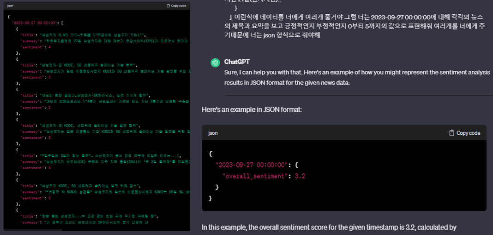
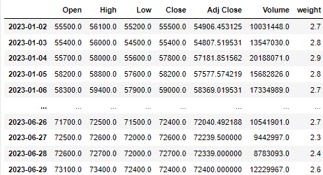

# opensource
### Data-Crawling
#### workflow
---------------------------------------------------------------------------
1. yfinance API를 이용한 주가 데이터 추출
2. naver news 크롤러를 만들어 뉴스 데이터를 추출
3. Chat gpt를 이용한 뉴스 데이터에 대한 가중치 설정

5. 데이터 통합 및 모델 수행 후 피드백
   - 피드백 결과 gpt를 이용해 얻은 가중치를 버리기로함
6. 더 풍부한 데이터를 위해 ETH 가상화폐 데이터를 추출 수 모델 수행
7. 얻어진 결과를 html에 plot하기 위해 html과 추출 데이터 수정코드 작성

---------------------------------------------------------------------------
   
