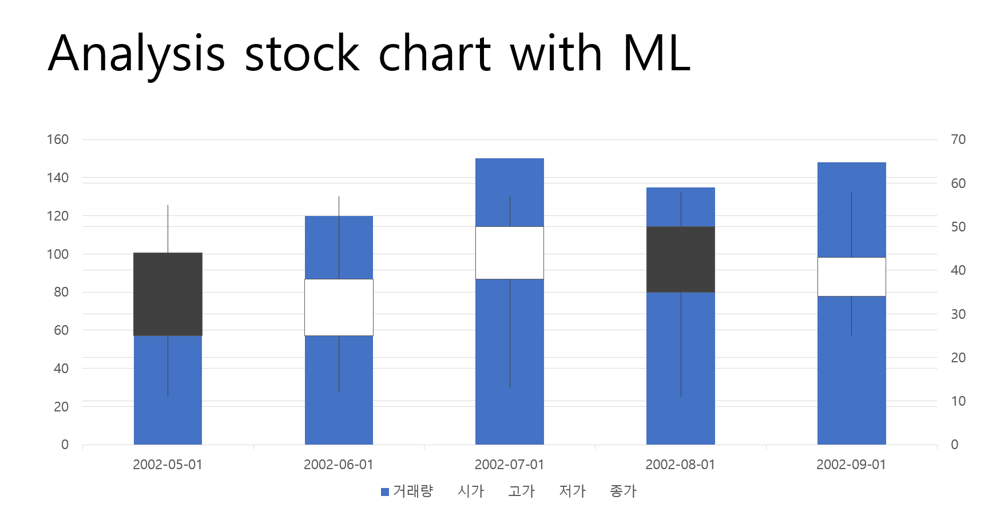
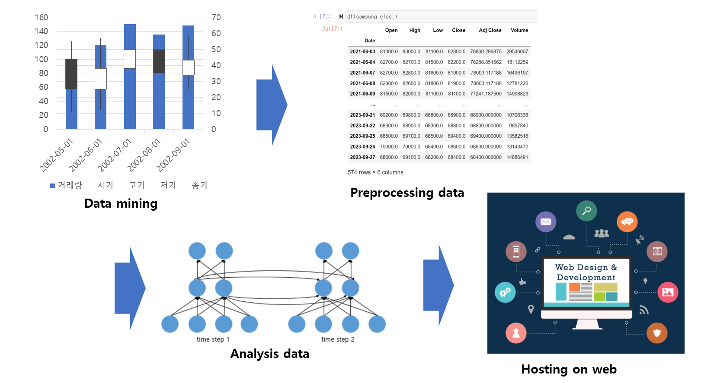
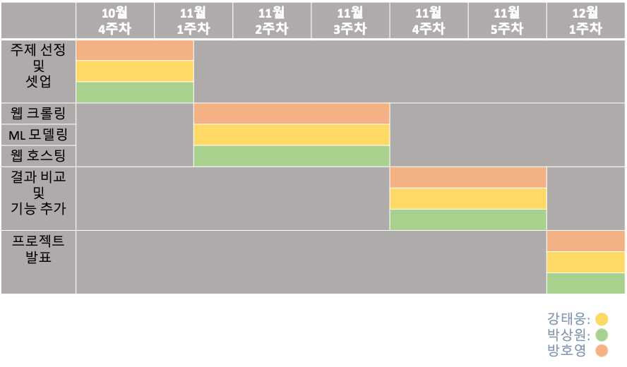

# [RNN기반의 주식 차트 분석 및 딥웹 호스팅]   

 ## Abstract
    
현재 Chat GPT와 같은 LLM 기반의 인공지능 모델들이 검색엔진을 통해 찾기 어려운 데이터를 정리하여 전달하여 주고 
이를 통해사람들은 하나의 개인비서가 있는 것처럼 활용할 수 있게 되었다.

이는 이전에는 사람이 직접 처리하여 가공해야 했던 정보를 컴퓨터가 대신해주며 사람의 편리성 증대 및 일의 효율성이 증대되었다. 이에 따라 machine learning에 대한 사람들의 관심도 또한 높아지게 되었고 우리는 이러한 추세에 따라 machine learning이 진행과정과 학습원리에 대해 이해하고자 본 프로젝트를 진행하게 되었다.

본 프로젝트는 주식 차트를 시계열 데이터로 바라보며 이를 RNN 기반의 LSTM 모델을 활용하여 주식 데이터를 분석하고 미래 주식의 종가를 예측하여 이를 웹에 호스팅하여 데이터를 공유한다. 이때 크롤링을 통해 습득된 데이터를 이용하여 만들어진 본 프로젝트의 결과물이 상업적, 악의적인 목적으로 활용되는 것을 방지하기 위해 인증된 사용자만이 웹사이트에 접속할 수 있도록 딥웹을 구성하고자 한다, 여기서 딥웹은 검색엔진을 통해 접근하는 일반적인 방법으로는 접근할 수 없는 웹 페이지를 통칭한다. 
   
본 프로젝트의 최종 목표는 주식 차트 분석 모델 설계, 더 나아가 매수, 매도에 있어서 사람의 결정을 보조해주는 하나의 데이터 분석 도구로써의 사용이며 machine learing을 통해 이전에 사람이 인지 할 수 없었던 부분에 대해서 새로운 데이터를 제시하고 이를 통해 이전까지 사람이 직접 분석해야했던 부분을 컴퓨터가 대신하여 편리성 증대 및 일의 효율성 상승을 추구하는 것이다. 

## basic workflow

1. get raw data (mining)
2. preprocessing
3. analysis (using RNN)
4. hosting results on web

 ## Project schedule

## Team roles & development areas

+ 강태웅   
RNN 기반 모델 구축   
데이터 베이스 암호화

+ 박상원   
웹 페이지 개설 및 호스팅

+ 방호영   
웹 크롤링   
데이터 전처리

## required technologies  
1. programming language   
    + python   
    + html/css/java script      
    *추후 프로젝트 진행중 필요한 언어가 있다면 변경 될 수 있다.*   

2. main concepts 
    + Web Crawling   
    + Machine learing   
    + Cryptography   
